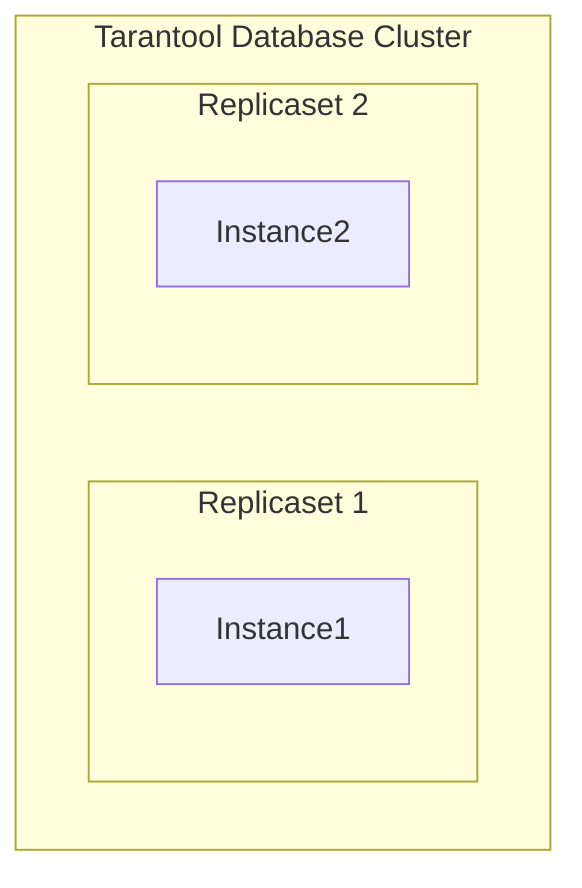

# Go VShard Router

go-vshard-router is a library for sending requests to a sharded tarantool cluster directly,
without using tarantool-router. go-vshard-router takes a new approach to creating your cluster 

# Getting started
