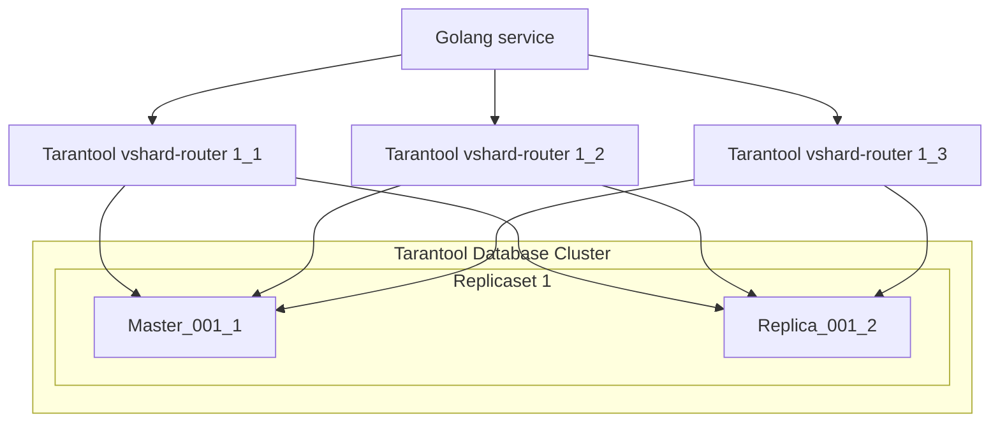
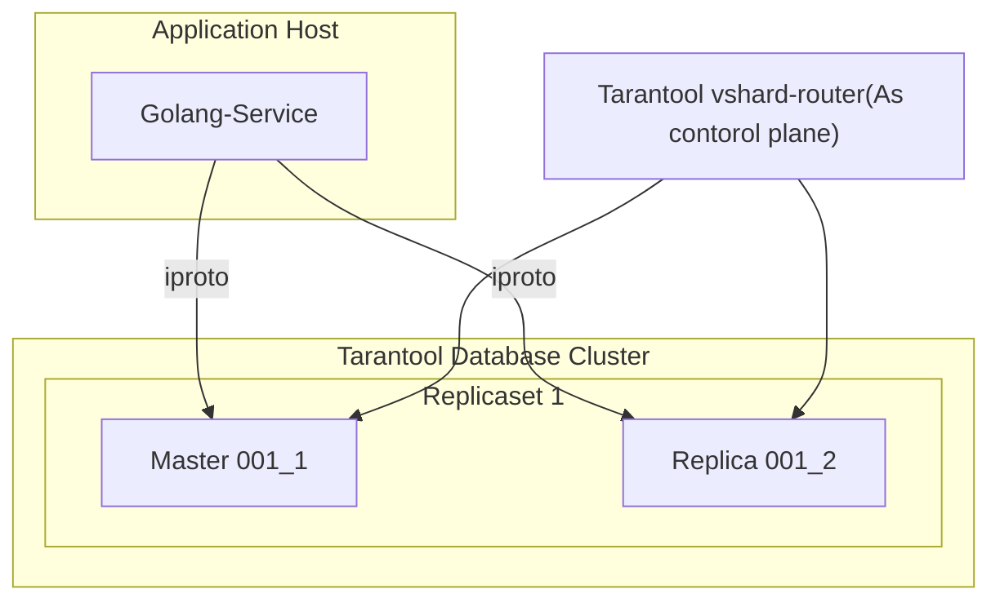

# Go VShard Router

go-vshard-router is a library for sending requests to a sharded tarantool cluster directly,
without using tarantool-router. go-vshard-router takes a new approach to creating your cluster

Old cluster schema

New cluster schema

# Getting started
### Prerequisites

- **[Go](https://go.dev/)**: any one of the **three latest major** [releases](https://go.dev/doc/devel/release) (we test it with these).

### Getting Go-Vshard-Router
With [Go module](https://github.com/golang/go/wiki/Modules) support, simply add the following import

```
import "github.com/KaymeKaydex/go-vhsard-router"
```
to your code, and then `go [build|run|test]` will automatically fetch the necessary dependencies.

Otherwise, run the following Go command to install the `go-vshard-router` package:

```sh
$ go get -u github.com/KaymeKaydex/go-vhsard-router
```

### Running Go-Vshard-Router

First you need to import Go-Vshard-Router package for using Go-Vshard-Router

```go
package main

import (
  "strconv"
  "context"
  "time"

  vshardrouter "github.com/KaymeKaydex/go-vhsard-router"
)

func main() {
	ctx := context.Background()
	directRouter, err := vshardrouter.NewRouter(ctx, vshardrouter.Config{
		DiscoveryTimeout: time.Minute,
		DiscoveryMode:    vshardrouter.DiscoveryModeOn,
		Replicasets:      cfg.Storage.Topology,
		TotalBucketCount: 128000,
		PoolOpts: tarantool.Opts{
			Timeout: time.Second, 
		},
	})
	if err != nil {
		panic(err)
	}

	bucketID := vshardrouter.BucketIDStrCRC32(strconv.FormatUint(req.UID, 10), c.directRouter.RouterBucketCount())

	interfaceResult, typedFnc, err := directRouter.RouterCallImpl(
		ctx,
		bucketID,
		vshardrouter.CallOpts{VshardMode: vshardrouter.ReadMode, PoolMode: pool.PreferRO, Timeout: time.Second * 2},
		"storage.api.get_user_info",
		[]interface{}{&struct {
			BucketID uint64                 `msgpack:"bucket_id" json:"bucket_id,omitempty"`
			Body     map[string]interface{} `msgpack:"body"`
		}{
			BucketID: bucketID,
			Body: map[string]interface{}{
				"user_id": "123456",
			},
		}},
	)
}
```