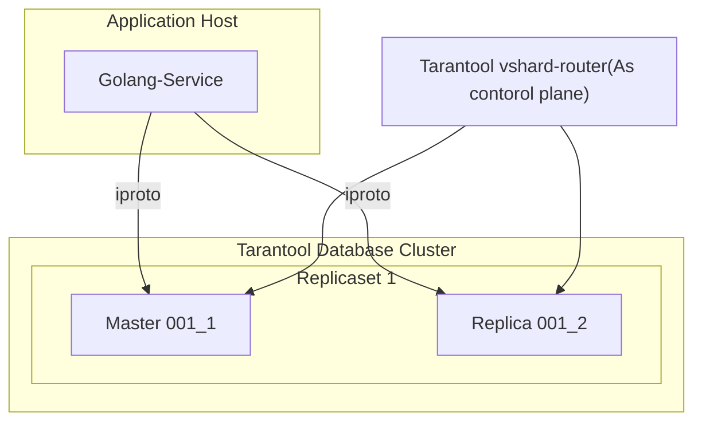

# Go VShard Router


Translations:
- [Русский](https://github.com/KaymeKaydex/go-vshard-router/blob/main/README_ru.md)


go-vshard-router is a library for sending requests to a sharded tarantool cluster directly,
without using tarantool-router. go-vshard-router takes a new approach to creating your cluster


<table>
    <tr>
        <th>Old cluster schema</th>
        <th>New cluster schema</th>
    </tr>
    <tr>
        <td>
            ```mermaid
            ```
        </td>
        <td>Ячейка 2.1</td>
    </tr>
</table>



# Getting started
### Prerequisites

- **[Go](https://go.dev/)**: any one of the **two latest major** [releases](https://go.dev/doc/devel/release) (we test it with these).

### Getting Go-Vshard-Router
With [Go module](https://github.com/golang/go/wiki/Modules) support, simply add the following import

```
import "github.com/KaymeKaydex/go-vshard-router"
```
to your code, and then `go [build|run|test]` will automatically fetch the necessary dependencies.

Otherwise, run the following Go command to install the `go-vshard-router` package:

```sh
$ go get -u github.com/KaymeKaydex/go-vshard-router
```

### Running Go-Vshard-Router

First you need to import Go-Vshard-Router package for using Go-Vshard-Router

```go
package main

import (
	"context"
	"fmt"
	"strconv"
	"time"

	vshardrouter "github.com/KaymeKaydex/go-vshard-router"
	"github.com/google/uuid"
	"github.com/tarantool/go-tarantool/v2"
	"github.com/tarantool/go-tarantool/v2/pool"
)

func main() {
	ctx := context.Background()

	directRouter, err := vshardrouter.NewRouter(ctx, vshardrouter.Config{
		DiscoveryTimeout: time.Minute,
		DiscoveryMode:    vshardrouter.DiscoveryModeOn,
		Replicasets: map[vshardrouter.ReplicasetInfo][]vshardrouter.InstanceInfo{
			vshardrouter.ReplicasetInfo{
				Name: "replcaset_1",
				UUID: uuid.New(),
			}: {
				{
					Addr: "127.0.0.1:1001",
					UUID: uuid.New(),
				},
				{
					Addr: "127.0.0.1:1002",
					UUID: uuid.New(),
				},
			},
			vshardrouter.ReplicasetInfo{
				Name: "replcaset_2",
				UUID: uuid.New(),
			}: {
				{
					Addr: "127.0.0.1:2001",
					UUID: uuid.New(),
				},
				{
					Addr: "127.0.0.1:2002",
					UUID: uuid.New(),
				},
			},
		},
		TotalBucketCount: 128000,
		PoolOpts: tarantool.Opts{
			Timeout: time.Second,
		},
	})
	if err != nil {
		panic(err)
	}

	user := struct {
		ID uint64
	}{
		ID: 123,
	}

	bucketID := vshardrouter.BucketIDStrCRC32(strconv.FormatUint(user.ID, 10), directRouter.RouterBucketCount())

	interfaceResult, getTyped, err := directRouter.RouterCallImpl(
		ctx,
		bucketID,
		vshardrouter.CallOpts{VshardMode: vshardrouter.ReadMode, PoolMode: pool.PreferRO, Timeout: time.Second * 2},
		"storage.api.get_user_info",
		[]interface{}{&struct {
			BucketID uint64                 `msgpack:"bucket_id" json:"bucket_id,omitempty"`
			Body     map[string]interface{} `msgpack:"body"`
		}{
			BucketID: bucketID,
			Body: map[string]interface{}{
				"user_id": "123456",
			},
		}},
	)

	info := &struct {
		BirthDay int
	}{}

	err = getTyped(&[]interface{}{info})
	if err != nil {
		panic(err)
	}

	fmt.Printf("interface result: %v", interfaceResult)
	fmt.Printf("get typed result: %v", info)
}
```

## Benchmarks
Topology: 
- 4 replicasets (x2 instances per rs)
- 4 tarantool proxy
- 1 golang service
### [K6](https://github.com/grafana/k6)

constant VUes scenario:
at a load close to production

```select```
- go-vshard-router: uncritically worse latency, but 3 times more rps
  
- tarantool-router: (80% cpu, heavy rps kills proxy at 100% cpu) 
  
