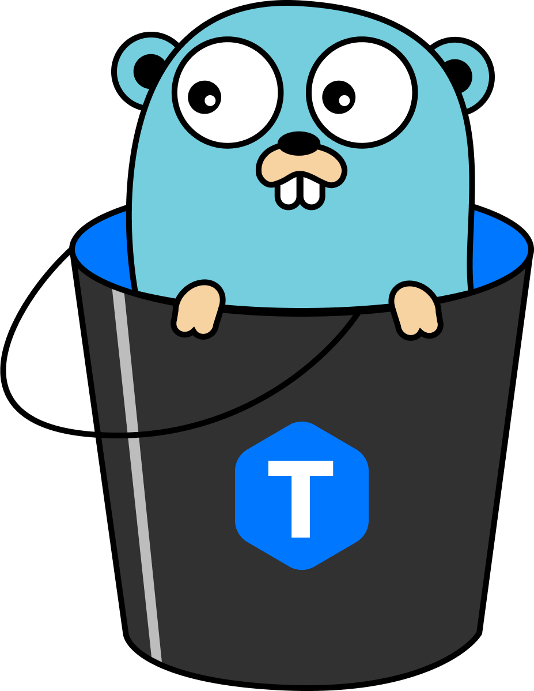
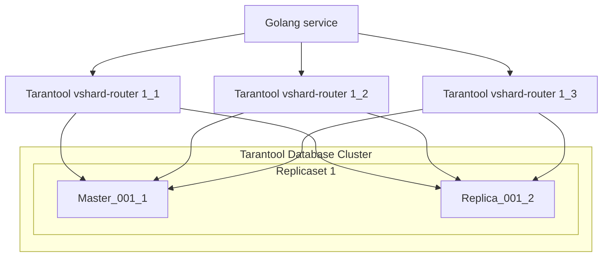
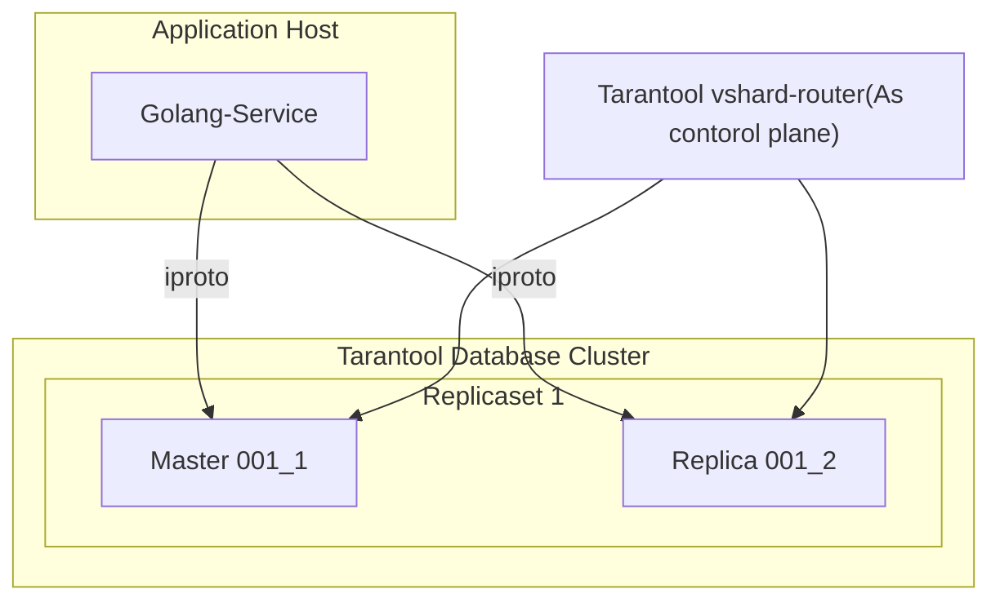

# Go VShard Router

> :warning: This project is depreacted and archived as the functionality moved to [tarantool/go-vshard-router](https://github.com/tarantool/go-vshard-router) repo. You can pull it using `go get github.com/tarantool/go-vshard-router/v2`. The API is simplified and morernized, yet functionality is similar. All questions and issues you can submit [here](https://github.com/tarantool/go-vshard-router/issues). 




[](https://pkg.go.dev/github.com/KaymeKaydex/go-vshard-router)
[![Actions Status][actions-badge]][actions-url]
[](https://goreportcard.com/report/github.com/KaymeKaydex/go-vshard-router)
[](https://codecov.io/gh/KaymeKaydex/go-vshard-router)
[](https://raw.githubusercontent.com/KaymeKaydex/go-vshard-router/master/LICENSE)

Translations:
- [Русский](https://github.com/KaymeKaydex/go-vshard-router/blob/main/README_ru.md)


go-vshard-router is a library for sending requests to a sharded tarantool cluster directly,
without using tarantool-router. This library based on [tarantool vhsard library router](https://github.com/tarantool/vshard/blob/master/vshard/router/init.lua). go-vshard-router takes a new approach to creating your cluster

Old cluster schema

New cluster schema

## Getting started
### Prerequisites

- **[Go](https://go.dev/)**: any one of the **two latest major** [releases](https://go.dev/doc/devel/release) (we test it with these).

### Getting Go-Vshard-Router
With [Go module](https://github.com/golang/go/wiki/Modules) support, simply add the following import

```
import "github.com/KaymeKaydex/go-vshard-router"
```
to your code, and then `go [build|run|test]` will automatically fetch the necessary dependencies.

Otherwise, run the following Go command to install the `go-vshard-router` package:

```sh
$ go get -u github.com/KaymeKaydex/go-vshard-router
```

### Running Go-Vshard-Router

First you need to import Go-Vshard-Router package for using Go-Vshard-Router

```go
package main

import (
  "context"
  "fmt"
  "strconv"
  "time"

  vshardrouter "github.com/KaymeKaydex/go-vshard-router"
  "github.com/KaymeKaydex/go-vshard-router/providers/static"

  "github.com/google/uuid"
  "github.com/tarantool/go-tarantool/v2"
  "github.com/tarantool/go-tarantool/v2/pool"
)

func main() {
  ctx := context.Background()

  directRouter, err := vshardrouter.NewRouter(ctx, vshardrouter.Config{
    DiscoveryTimeout: time.Minute,
    DiscoveryMode:    vshardrouter.DiscoveryModeOn,
    TopologyProvider: static.NewProvider(map[vshardrouter.ReplicasetInfo][]vshardrouter.InstanceInfo{
      vshardrouter.ReplicasetInfo{
        Name: "replcaset_1",
        UUID: uuid.New(),
      }: {
        {
          Addr: "127.0.0.1:1001",
          UUID: uuid.New(),
        },
        {
          Addr: "127.0.0.1:1002",
          UUID: uuid.New(),
        },
      },
      vshardrouter.ReplicasetInfo{
        Name: "replcaset_2",
        UUID: uuid.New(),
      }: {
        {
          Addr: "127.0.0.1:2001",
          UUID: uuid.New(),
        },
        {
          Addr: "127.0.0.1:2002",
          UUID: uuid.New(),
        },
      },
    }),
    TotalBucketCount: 128000,
    PoolOpts: tarantool.Opts{
      Timeout: time.Second,
    },
  })
  if err != nil {
    panic(err)
  }

  user := struct {
    ID uint64
  }{
    ID: 123,
  }

  bucketID := vshardrouter.BucketIDStrCRC32(strconv.FormatUint(user.ID, 10), directRouter.RouterBucketCount())

  interfaceResult, getTyped, err := directRouter.RouterCallImpl(
    ctx,
    bucketID,
    vshardrouter.CallOpts{VshardMode: vshardrouter.ReadMode, PoolMode: pool.PreferRO, Timeout: time.Second * 2},
    "storage.api.get_user_info",
    []interface{}{&struct {
      BucketID uint64                 `msgpack:"bucket_id" json:"bucket_id,omitempty"`
      Body     map[string]interface{} `msgpack:"body"`
    }{
      BucketID: bucketID,
      Body: map[string]interface{}{
        "user_id": "123456",
      },
    }},
  )

  info := &struct {
    BirthDay int
  }{}

  err = getTyped(&[]interface{}{info})
  if err != nil {
    panic(err)
  }

  fmt.Printf("interface result: %v", interfaceResult)
  fmt.Printf("get typed result: %v", info)
}
```
### Learn more examples
#### Quick Start
Learn with th [Quick Start](docs/doc.md), which include  examples and theory.
#### [Customer service](examples/customer/README.md)
Service with go-vshard-router on top of the tarantool example from the original vshard library using raft

## Benchmarks
### Go Bench

| Benchmark                             | Runs   | Time (ns/op) | Memory (B/op) | Allocations (allocs/op) |
|---------------------------------------|--------|---------------|----------------|-------------------------|
| BenchmarkCallSimpleInsert_GO-12       | 14216  | 81118         | 1419           | 29                      |
| BenchmarkCallSimpleInsert_Lua-12      | 9580   | 123307        | 1131           | 19                      |
| BenchmarkCallSimpleSelect_GO-12       | 18832  | 65190         | 1879           | 38                      |
| BenchmarkCallSimpleSelect_Lua-12      | 9963   | 104781        | 1617           | 28                      |


### [K6](https://github.com/grafana/k6)
Topology:
- 4 replicasets (x2 instances per rs)
- 4 tarantool proxy
- 1 golang service

constant VUes scenario:
at a load close to production

```select```
- go-vshard-router: uncritically worse latency, but 3 times more rps
  
- tarantool-router: (80% cpu, heavy rps kills proxy at 100% cpu) 
  


[actions-badge]: https://github.com/KaymeKaydex/go-vshard-router/actions/workflows/main.yml/badge.svg
[actions-url]: https://github.com/KaymeKaydex/go-vshard-router/actions/workflows/main.yml
