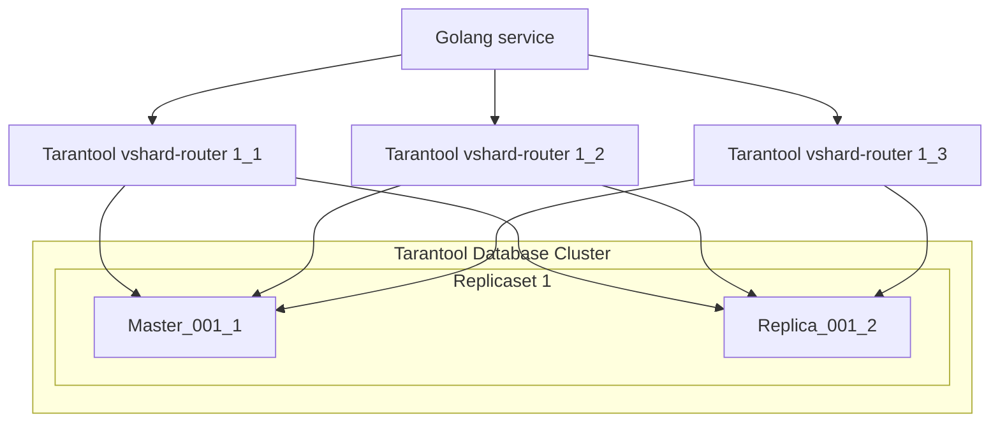
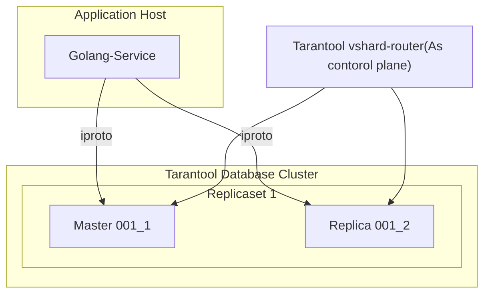

# Go VShard Router
Translations:
- [Русский](https://github.com/KaymeKaydex/go-vhsard-router/blob/main/README_ru.md)


go-vshard-router is a library for sending requests to a sharded tarantool cluster directly,
without using tarantool-router. go-vshard-router takes a new approach to creating your cluster

Old cluster schema

New cluster schema

# Getting started
### Prerequisites

- **[Go](https://go.dev/)**: any one of the **two latest major** [releases](https://go.dev/doc/devel/release) (we test it with these).

### Getting Go-Vshard-Router
With [Go module](https://github.com/golang/go/wiki/Modules) support, simply add the following import

```
import "github.com/KaymeKaydex/go-vhsard-router"
```
to your code, and then `go [build|run|test]` will automatically fetch the necessary dependencies.

Otherwise, run the following Go command to install the `go-vshard-router` package:

```sh
$ go get -u github.com/KaymeKaydex/go-vhsard-router
```

### Running Go-Vshard-Router

First you need to import Go-Vshard-Router package for using Go-Vshard-Router

```go
package main

import (
	"context"
	"fmt"
	"strconv"
	"time"

	vshardrouter "github.com/KaymeKaydex/go-vhsard-router"
	"github.com/google/uuid"
	"github.com/tarantool/go-tarantool/v2"
	"github.com/tarantool/go-tarantool/v2/pool"
)

func main() {
	ctx := context.Background()

	directRouter, err := vshardrouter.NewRouter(ctx, vshardrouter.Config{
		DiscoveryTimeout: time.Minute,
		DiscoveryMode:    vshardrouter.DiscoveryModeOn,
		Replicasets: map[vshardrouter.ReplicasetInfo][]vshardrouter.InstanceInfo{
			vshardrouter.ReplicasetInfo{
				Name: "replcaset_1",
				UUID: uuid.New(),
			}: {
				{
					Addr: "127.0.0.1:1001",
					UUID: uuid.New(),
				},
				{
					Addr: "127.0.0.1:1002",
					UUID: uuid.New(),
				},
			},
			vshardrouter.ReplicasetInfo{
				Name: "replcaset_2",
				UUID: uuid.New(),
			}: {
				{
					Addr: "127.0.0.1:2001",
					UUID: uuid.New(),
				},
				{
					Addr: "127.0.0.1:2002",
					UUID: uuid.New(),
				},
			},
		},
		TotalBucketCount: 128000,
		PoolOpts: tarantool.Opts{
			Timeout: time.Second,
		},
	})
	if err != nil {
		panic(err)
	}

	user := struct {
		ID uint64
	}{
		ID: 123,
	}

	bucketID := vshardrouter.BucketIDStrCRC32(strconv.FormatUint(user.ID, 10), directRouter.RouterBucketCount())

	interfaceResult, getTyped, err := directRouter.RouterCallImpl(
		ctx,
		bucketID,
		vshardrouter.CallOpts{VshardMode: vshardrouter.ReadMode, PoolMode: pool.PreferRO, Timeout: time.Second * 2},
		"storage.api.get_user_info",
		[]interface{}{&struct {
			BucketID uint64                 `msgpack:"bucket_id" json:"bucket_id,omitempty"`
			Body     map[string]interface{} `msgpack:"body"`
		}{
			BucketID: bucketID,
			Body: map[string]interface{}{
				"user_id": "123456",
			},
		}},
	)

	info := &struct {
		BirthDay int
	}{}

	err = getTyped(&[]interface{}{info})
	if err != nil {
		panic(err)
	}

	fmt.Printf("interface result: %v", interfaceResult)
	fmt.Printf("get typed result: %v", info)
}
```

## Benchmarks

### [K6](https://github.com/grafana/k6)

constant VUes scenario:
- go-vshard-router:
```
        /\      |‾‾| /‾‾/   /‾‾/
   /\  /  \     |  |/  /   /  /
  /  \/    \    |     (   /   ‾‾\
 /          \   |  |\  \ |  (‾)  |
/ __________ \  |__| \__\ \_____/ .io

     scenarios: (100.00%) 1 scenario, 500 max VUs, 1m0s max duration (incl. graceful stop):
              * demo: 500 looping VUs for 30s (gracefulStop: 30s)

     ✓ status was 200

checks.........................: 100.00% ✓ 5156515       ✗ 0
data_received..................: 387 MB  13 MB/s
data_sent......................: 1.2 GB  41 MB/s
http_req_blocked...............: avg=4.2µs   min=623ns    med=1.94µs  max=44.89ms p(90)=3.55µs  p(95)=4.77µs
http_req_connecting............: avg=527ns   min=0s       med=0s      max=26.83ms p(90)=0s      p(95)=0s
✓ http_req_duration..............: avg=2.22ms  min=158.08µs med=1.45ms  max=65.18ms p(90)=4.86ms  p(95)=6.7ms
{ expected_response:true }...: avg=2.22ms  min=158.08µs med=1.45ms  max=65.18ms p(90)=4.86ms  p(95)=6.7ms
http_req_failed................: 0.00%   ✓ 0             ✗ 5156515
http_req_receiving.............: avg=47.23µs min=3.69µs   med=13.79µs max=40.63ms p(90)=23.41µs p(95)=36.92µs
http_req_sending...............: avg=31.53µs min=4.38µs   med=11.55µs max=46.62ms p(90)=21.1µs  p(95)=28.63µs
http_req_tls_handshaking.......: avg=0s      min=0s       med=0s      max=0s      p(90)=0s      p(95)=0s
http_req_waiting...............: avg=2.14ms  min=143.95µs med=1.4ms   max=40.34ms p(90)=4.72ms  p(95)=6.48ms
http_reqs......................: 5156515 171855.672553/s
iteration_duration.............: avg=2.77ms  min=214.26µs med=1.9ms   max=76.55ms p(90)=5.64ms  p(95)=7.74ms
iterations.....................: 5156515 171855.672553/s
vus............................: 500     min=500         max=500
vus_max........................: 500     min=500         max=500


running (0m30.0s), 000/500 VUs, 5156515 complete and 0 interrupted iterations
demo ✓ [======================================] 500 VUs  30s
```

- tarantool-router