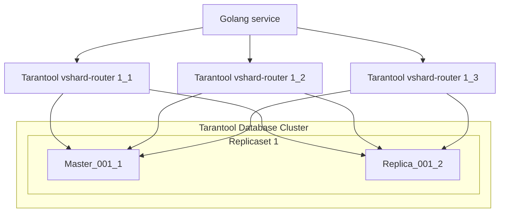
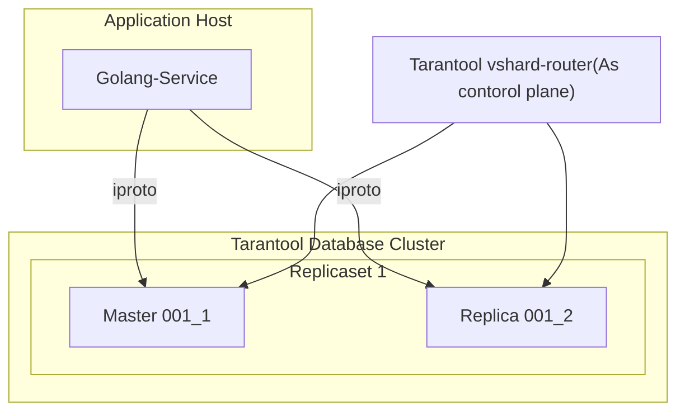

# Go VShard Router
Translations:
- [English](https://github.com/KaymeKaydex/go-vhsard-router/blob/main/README.md)

go-vshard-router — библиотека для отправки запросов напрямую в стораджа в шардированный кластер tarantool,
без использования tarantool-router. go-vshard-router применяет новый подход к созданию кластера

Схема кластера с tarantool-proxy

Новая схема использования

## Как начать использовать?
### Предварительные условия

- **[Go](https://go.dev/)**: любая из **двух последних мажорных версий** [releases](https://go.dev/doc/devel/release).

### Установка Go-Vshard-Router

