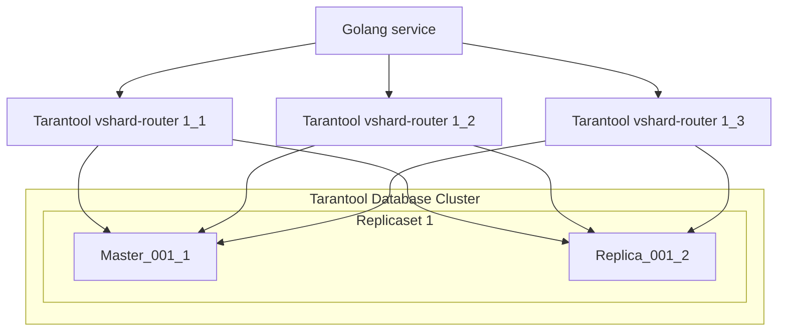
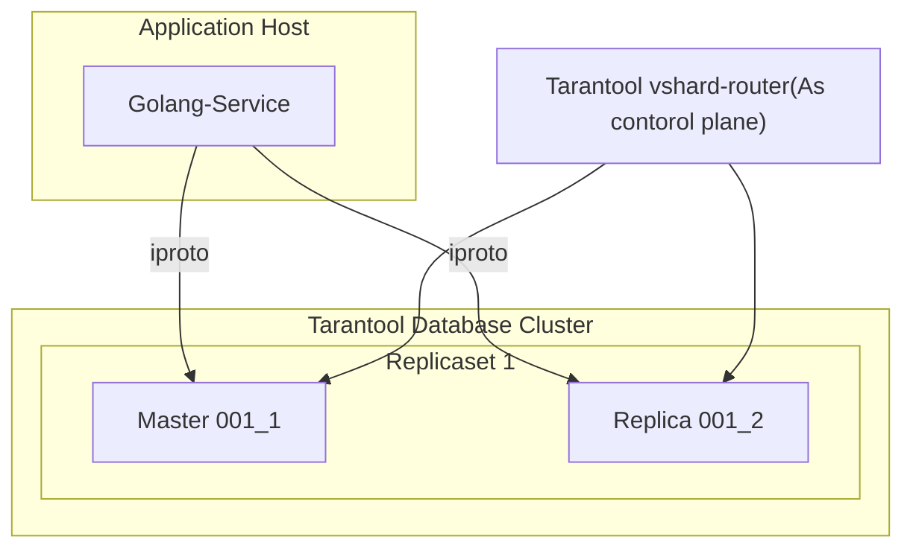
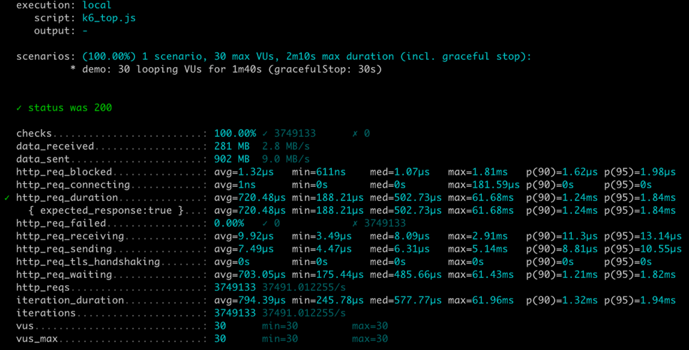

# Go VShard Router


[](https://goreportcard.com/report/github.com/KaymeKaydex/go-vshard-router)
[](https://codecov.io/gh/KaymeKaydex/go-vshard-router)
[](https://pkg.go.dev/github.com/KaymeKaydex/go-vshard-router)

Translations:
- [English](https://github.com/KaymeKaydex/go-vshard-router/blob/main/README.md)

go-vshard-router — библиотека для отправки запросов напрямую в стораджа в шардированный кластер tarantool,
без использования tarantool-router. go-vshard-router применяет новый подход к созданию кластера

Схема кластера с tarantool-proxy


Новая схема использования

## Как начать использовать?
### Предварительные условия

- **[Go](https://go.dev/)**: любая из **двух последних мажорных версий** [releases](https://go.dev/doc/devel/release).

### Установка Go-Vshard-Router
С помощью [Go module](https://github.com/golang/go/wiki/Modules) можно добавить следующий импорт

```
import "github.com/KaymeKaydex/go-vshard-router"
```
в ваш код, а затем `go [build|run|test]` автоматически получит необходимые зависимости.


В противном случае выполните следующую команду Go, чтобы установить пакет go-vshard-router:
```sh
$ go get -u github.com/KaymeKaydex/go-vshard-router
```

### Использование Go-Vshard-Router

Сначала вам необходимо импортировать пакет go-vshard-router для его использования.

```go
package main

import (
	"context"
	"fmt"
	"strconv"
	"time"

	vshardrouter "github.com/KaymeKaydex/go-vshard-router"
	"github.com/KaymeKaydex/go-vshard-router/providers/static"

	"github.com/google/uuid"
	"github.com/tarantool/go-tarantool/v2"
	"github.com/tarantool/go-tarantool/v2/pool"
)

func main() {
	ctx := context.Background()

	directRouter, err := vshardrouter.NewRouter(ctx, vshardrouter.Config{
		DiscoveryTimeout: time.Minute,
		DiscoveryMode:    vshardrouter.DiscoveryModeOn,
		TopologyProvider: static.NewProvider(map[vshardrouter.ReplicasetInfo][]vshardrouter.InstanceInfo{
			vshardrouter.ReplicasetInfo{
				Name: "replcaset_1",
				UUID: uuid.New(),
			}: {
				{
					Addr: "127.0.0.1:1001",
					UUID: uuid.New(),
				},
				{
					Addr: "127.0.0.1:1002",
					UUID: uuid.New(),
				},
			},
			vshardrouter.ReplicasetInfo{
				Name: "replcaset_2",
				UUID: uuid.New(),
			}: {
				{
					Addr: "127.0.0.1:2001",
					UUID: uuid.New(),
				},
				{
					Addr: "127.0.0.1:2002",
					UUID: uuid.New(),
				},
			},
		}),
		TotalBucketCount: 128000,
		PoolOpts: tarantool.Opts{
			Timeout: time.Second,
		},
	})
	if err != nil {
		panic(err)
	}

	user := struct {
		ID uint64
	}{
		ID: 123,
	}

	bucketID := vshardrouter.BucketIDStrCRC32(strconv.FormatUint(user.ID, 10), directRouter.RouterBucketCount())

	interfaceResult, getTyped, err := directRouter.RouterCallImpl(
		ctx,
		bucketID,
		vshardrouter.CallOpts{VshardMode: vshardrouter.ReadMode, PoolMode: pool.PreferRO, Timeout: time.Second * 2},
		"storage.api.get_user_info",
		[]interface{}{&struct {
			BucketID uint64                 `msgpack:"bucket_id" json:"bucket_id,omitempty"`
			Body     map[string]interface{} `msgpack:"body"`
		}{
			BucketID: bucketID,
			Body: map[string]interface{}{
				"user_id": "123456",
			},
		}},
	)

	info := &struct {
		BirthDay int
	}{}

	err = getTyped(&[]interface{}{info})
	if err != nil {
		panic(err)
	}

	fmt.Printf("interface result: %v", interfaceResult)
	fmt.Printf("get typed result: %v", info)
}

```
### Ознакомьтесь с другими примерами
#### [Customer service](examples/customer/README.ru.md)
Сервис с go-vshard-router поверх примера тарантула из оригинальной библиотеки vshard с использованием raft

## Бенчмарки

Топология:
- 4 репликасета (x2 инстанса на репликасет)
- 4 тарантул прокси
- 1 инстанс гошного сервиса
### [K6](https://github.com/grafana/k6)

сценарий constant VUes:
в нагрузке близкой к продовой

```select```
- go-vshard-router: uncritically worse latency, but 3 times more rps
  
- tarantool-router: (80% cpu, heavy rps kills proxy at 100% cpu)
  
